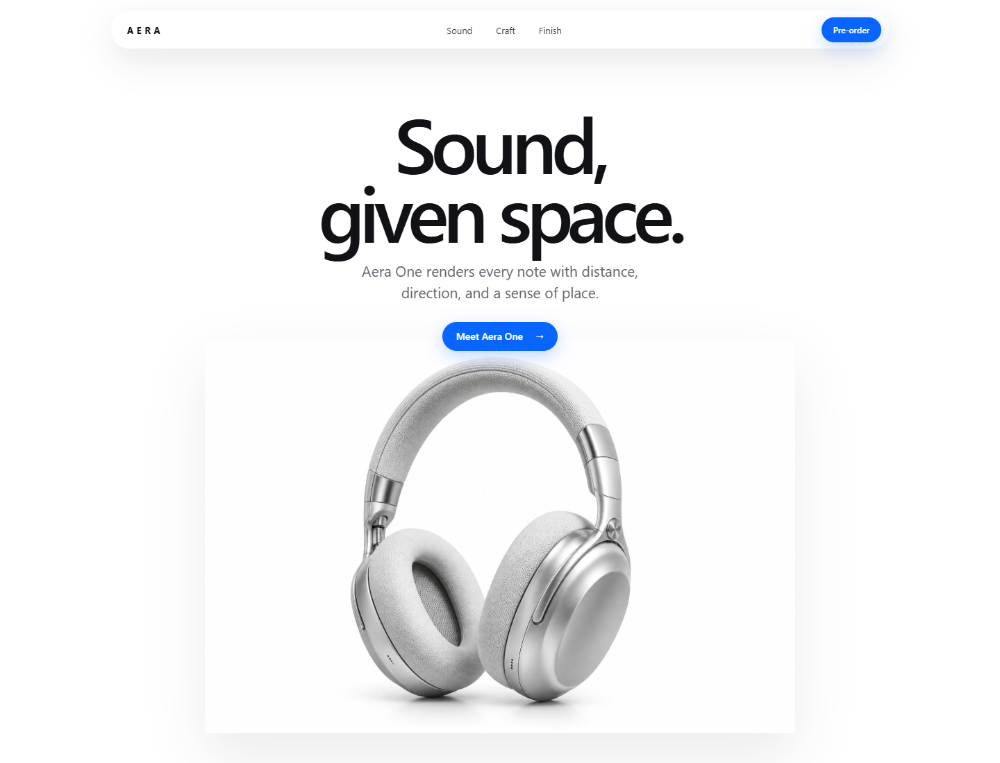

# Fable5 Design Chain

Upgrade any coding agent's frontend design process with a portable three-layer skill chain.

The skill helps an agent understand the environment before coding, commit to an intentional visual direction, break generic AI design defaults, and verify the rendered product instead of stopping when the build passes.

## What It Adds

1. **Environment preflight** - inspect the repo, existing design system, assets, dependencies, constraints, and current UI before choosing a direction.
2. **Design reasoning** - define purpose, audience, hierarchy, constraints, visual thesis, and three calibration axes: layout variance, motion intensity, and visual density.
3. **Cookbook and quality gates** - apply context-aware typography, color, composition, motion, redesign, accessibility, responsive, and rendered-product QA guidance.

It works with Codex, Claude Code, Cursor, and other coding agents that support Agent Skills or can load Markdown instructions.

## Why "Fable5 Design Chain"

"Fable5 Design Chain" describes the target workflow and quality bar: a layered instruction chain that gives a capable model environment knowledge, anti-default guidance, and a design-thinking framework before it writes frontend code.

This project does not change model weights, guarantee parity with any specific model, or claim affiliation with Anthropic, OpenAI, or any model provider.

## Install

Install with the Agent Skills CLI:

```bash
npx skills add https://github.com/NimaChu/fable5-design-chain --skill fable5-design-chain
```

Or copy `skills/fable5-design-chain` into your agent's skills directory.

For Codex, place it under:

```text
~/.codex/skills/fable5-design-chain
```

Invoke it explicitly:

```text
Use $fable5-design-chain to redesign this dashboard and visually verify the result.
```

Its metadata is also written to trigger automatically for frontend creation, redesign, restyling, and visual review work.

## Design Principles

- Treat design direction as an engineering input.
- Inspect the product and environment before choosing an aesthetic.
- Use one context-specific visual thesis rather than fashionable defaults.
- Calibrate creative freedom instead of maximizing it.
- Preserve workflows, brand anchors, and product meaning during redesigns.
- Inspect the rendered UI across desktop and mobile; a successful build is not visual QA.
- Prefer progressive disclosure over one enormous wall of rules.

## Live Forward Test

The repository includes a real test case generated after the rename to
`fable5-design-chain`:



**Prompt:** "Create a modern Apple-inspired webpage."

**Result:** `examples/aera-one-apple-style/` is a static fictional product page
for "Aera One," an over-ear spatial audio concept. It avoids Apple logos,
real Apple products, and copied Apple marketing text while still testing the
kind of precise spacing, product imagery, responsive behavior, and polished
interaction states that an Apple-inspired brief tends to demand.

The forward test exposed and fixed concrete quality issues:

- Reveal-animation screenshots initially hid useful content, so the demo keeps
  revealed content visible during capture while retaining motion.
- CSS `filter` color swaps polluted white product backgrounds, so finish
  swatches now switch between real image assets.
- A later mobile screenshot pass caught a small-width overflow risk, so the
  mobile hero and floating navigation were tightened before publishing.

Validation covered desktop and 390px mobile viewports, image loading, no
horizontal overflow, desktop navigation, mobile navigation collapse, finish
switching to `aera-blue.png` and `aera-graphite.png`, and pre-order CTA
feedback.

## Structure

```text
skills/fable5-design-chain/
  SKILL.md
  agents/openai.yaml
  references/
    calibration-and-redesign.md
    design-cookbook.md
    preflight-and-qa.md

examples/
  aera-one-apple-style/
    index.html
    styles.css
    app.js
    assets/
    screenshots/
```

## Influences

This skill synthesizes and adapts ideas from:

- Anthropic's [frontend-design skill](https://github.com/anthropics/claude-code/blob/main/plugins/frontend-design/skills/frontend-design/SKILL.md)
- Anthropic's [Frontend Aesthetics Cookbook](https://github.com/anthropics/claude-cookbooks/blob/main/coding/prompting_for_frontend_aesthetics.ipynb)
- The community-posted [Claude Fable 5 prompt](https://github.com/elder-plinius/CL4R1T4S/blob/main/ANTHROPIC/CLAUDE-FABLE-5.md), especially its mandatory skill-loading pattern
- Leonxlnx's [taste-skill](https://github.com/Leonxlnx/taste-skill), especially calibration axes, redesign auditing, and mechanical preflight checks

The resulting skill is rewritten for portable coding-agent use, progressive disclosure, broad frontend coverage, and context-aware rules.

## License

MIT
