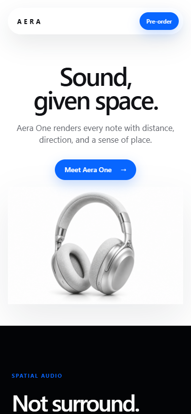

# Aera One Apple-Inspired Forward Test

This is a static demo created as a live forward test for
`fable5-design-chain`.

## Prompt

```text
Create a modern Apple-inspired webpage.
```

## Design Brief

- Purpose: present a fictional spatial-audio headphone concept with a polished
  product-first landing page.
- Audience: design and engineering reviewers checking whether the skill can
  produce a credible premium frontend without copying Apple assets or text.
- Visual thesis: a quiet luxury product page for a spatial-audio concept,
  expressed through oversized system typography, centered product staging,
  white-space discipline, a restrained silver/black/blue palette, and finish
  switching as the signature interaction.
- Constraints: no Apple logo, no real Apple product imagery, no copied Apple
  marketing language, static HTML/CSS/JS only.

## What The Skill Caught

- Reveal animations can make screenshots look empty when the capture happens
  before intersection state is applied. This demo keeps `.reveal` content
  visible while retaining the entrance transform.
- CSS filter-based finish changes can tint the product image's white
  background and create a visible rectangular edge. The final version swaps
  actual image assets for silver, graphite, and blue finishes.
- A screenshot pass found mobile-width pressure in the hero and fixed
  navigation. The final mobile rules keep the first viewport inside 390px
  without horizontal scrolling.

## Validation

Validated with Chrome/Playwright against `http://127.0.0.1:4173/`:

- desktop viewport: `1440 x 1100`
- mobile viewport: `390 x 844`
- no horizontal overflow in either viewport
- all product images load with non-zero natural size
- desktop navigation remains visible and unwrapped
- mobile navigation collapses
- finish swatches switch to `assets/aera-blue.png` and
  `assets/aera-graphite.png`
- pre-order button writes visible status feedback

## Preview



